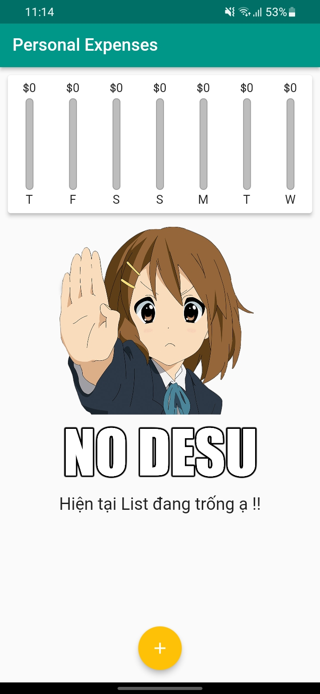
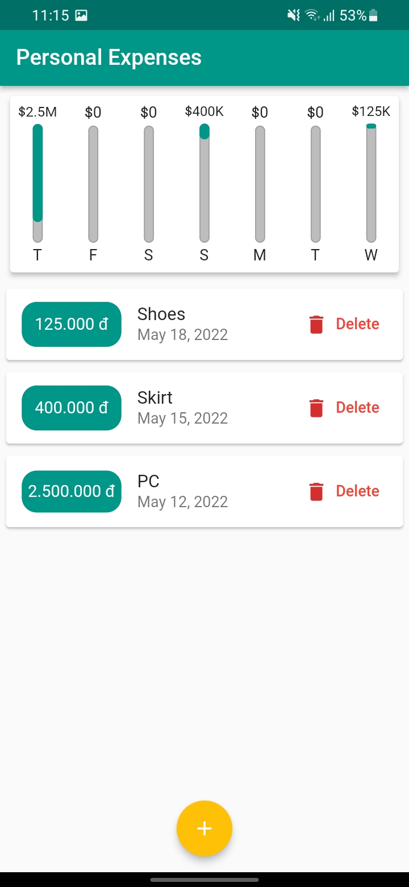
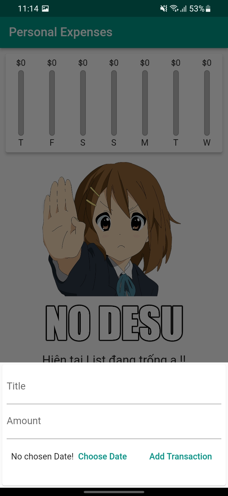

## Personal Expenses App

<br>

## Introduction

My first App using Flutter

<div style=" display:inline-block">





</div>

## What does this app do?

This app helps you manage personal expenses in one week, so you can control your spending,

## Feature

+ A Chart Bar to overview your spending
+ Add new Transaction
+ Remove
+ Pick Date in one week
+ Adaptive Style for Android & IOS
+ Responsive for small-Screen-Device
+ Ugly App

## Installation

```
# clone this project
cd [this-project]
flutter clean
flutter pub get
flutter build apk
flutter install
